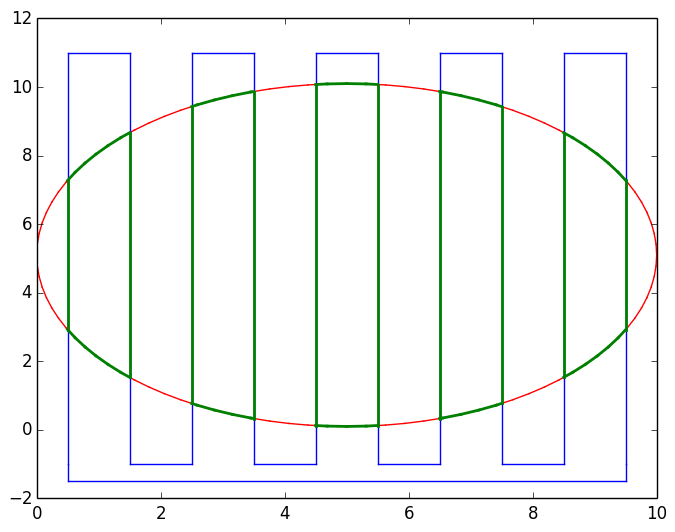

# PolygonClipping

PolygonClipping.jl is a Julia package for [polygon clipping](https://en.wikipedia.org/wiki/Clipping_%28computer_graphics%29). It implements the [Greiner-Hormann algorithm](https://en.wikipedia.org/wiki/Greiner-Hormann_clipping_algorithm) for clipping and the Hormann-Agathos algorithm to see if a [point is in a polygon](https://en.wikipedia.org/wiki/Point_in_polygon).

!!! The original code for this was written in 2014 and is very much so a prototype in its current state. !!!

!!! Use with caution. !!!

## References
The papers by Günther Greiner, Kai Hormann, and Alexander Agathos served as the basis for this library.

* [Greiner, Günther; Kai Hormann (1998). "Efficient clipping of arbitrary polygons". ACM Transactions on Graphics (TOG) 17 (2): 71–83.](http://dl.acm.org/citation.cfm?id=274364)
* [Hormann, K.; Agathos, A. (2001). "The point in polygon problem for arbitrary polygons". Computational Geometry 20 (3): 131. ](http://www.sciencedirect.com/science/article/pii/S0925772101000128)

## License
The PolygonClipping.jl package is licensed under the MIT "Expat" License. See [LICENSE.md](./LICENSE.md).
